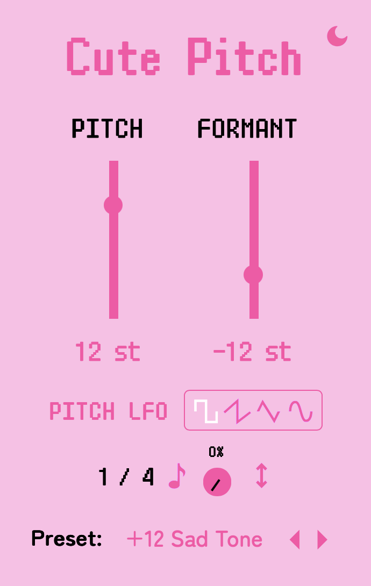

# Cute Pitch

Cute Pitch is a VST plugin for pitch and formant shifting.

### Controls:
- Pitch - the pitch shift in semitones (-24/+24)
- Formant - the formant shift in semitones (-24/+24)
- Pitch LFO Waveform - pick from square, sawtooth, triangle, and sine shapes for the pitch LFO. 
- Pitch LFO Rate - the speed of the pitch LFO in bpm synced times.
- Pitch LFO Amount - the amount of the pitch LFO effect applied.
- Pitch LFO Invert - inverts the phase of the pitch LFO.

I used a third party lib to do the pitch shifting because... that is way too complex for me 
to implement, but I may attempt it one day.

### Design

Our design is available here: https://www.figma.com/design/WuLkZAoYlmBKa1sHAjo7Iq/Cute-Pitch

### Purchase

### See Also

- [Cute Gain](https://github.com/Moebytes/Cute-Gain) 
- [Cute Crush](https://github.com/Moebytes/Cute-Crush)
- [Cute Filter](https://github.com/Moebytes/Cute-Filter)
